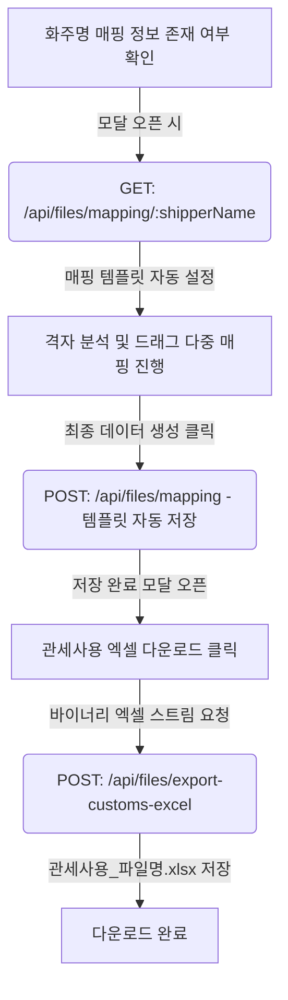

# 📝 화주/포워더 포털 - 관세사 데이터 검증 및 매핑 시스템 개발 메모

본 문서에는 선적 서류 검증 시스템, 엑셀 격자 뷰어 매핑 인터페이스, 화주 템플릿 자동 기억 및 관세사용 엑셀 다운로드 기능에 대한 최종 구현 사양과 기술 구조가 기록되어 있습니다.

---

## 🚀 1. 구현된 주요 기능 목록

### 1️⃣ 관세사용 엑셀 변환 내보내기 & 접두어 (`관세사용_`) 처리
* **동적 스칼라 영역 설계**: 사용자가 지정한 모든 단일 셀 매핑 필드(스칼라 값)를 수집하여 엑셀 상단에 배치합니다. 한 행당 최대 3개(Col A-B, C-D, E-F)의 라벨-값 페어를 정렬하며, 초과 시 행이 자동으로 추가됩니다.
* **품목 테이블 동적 위치 조정**: 스칼라 영역의 높이에 따라 하단의 품목 테이블(Items Table)이 겹침 없이 자동으로 아래쪽 행으로 밀려 렌더링되도록 구현했습니다.
* **실물 엑셀 생성 (`exceljs`)**: 백엔드에서 격자 데이터를 바탕으로 셀 테두리, 배경 색상(Navy 테마), 숫자 3자리 콤마 포맷(`#,##0`)이 완벽히 적용된 실물 `.xlsx` 파일을 만듭니다.
* **파일명 규칙**: 모달 내부 다운로드 시 파일명에 `관세사용_` 접두어가 자동으로 붙습니다. (예: `관세사용_Invoice_2026.xlsx`)

### 2️⃣ 화주(Shipper)별 자동 매핑 저장 및 복원 (템플릿 시스템)
* **`shipper_mappings` DB 연동**: 데이터베이스에 화주별 매핑 내역을 보관하는 테이블이 자동으로 정의됩니다.
* **자동 복원 (Load)**: 모달 창이 열리거나 다른 탭으로 변경되어 엑셀 격자가 로드될 때, **해당 화주의 기존 매핑 설정을 DB에서 자동으로 조회하여 뷰어에 복구**시킵니다.
* **자동 저장 (Save)**: 매핑 후 `[최종 데이터 생성]`을 클릭하면, 현재 구성된 매핑 레이아웃이 해당 화주명(Shipper Name)에 1:1로 묶여 DB에 자동으로 갱신 저장됩니다.

### 3️⃣ 드래그 2D 다중 매핑 및 순차 클릭 매핑 큐 시스템
* **순차 큐 매핑**: 우측 배지 패널에서 `품명` ➔ `수량` ➔ `단위` 등을 연속해서 클릭하면 번호 배지가 쌓이며 큐가 생성됩니다.
* **2D 드래그 & 자동 바인딩**: 마우스 드래그를 이용해 그리드에서 데이터 영역을 2D 형태로 긁어 릴리즈(`mouseup`)하면, 선택된 열들에 대해 큐에 쌓인 매핑 배지가 순서대로 일괄 매핑됩니다.
* **드래그 중 자동 스크롤**: 데이터 영역 선택 시 마우스가 격자 뷰어 경계선 밖으로 넘어가면 화면이 마우스 포인터가 가리키는 방향으로 자동으로 스크롤(Auto-scrolling)됩니다.

### 4️⃣ 시작 행(startRow) 1칸 위에 배지 자동 배치 (Label Placement)
* **시각 보정**: 지정한 행 범위의 시작 행 바로 윗행(`startRow - 1`) 셀 내부에 한글 라벨 배지(예: `[수량 ✕]`)를 배치해, 엑셀 본래의 라벨 자리 위에 뱃지가 얹혀진 직관적인 UI를 제공합니다.
* **예외 처리**: 시작 행이 첫 번째 행(`startRow === 0`)이어서 더 이상 위쪽 칸이 존재하지 않는 경우에만 고정 헤더(`<th>`)에 표시됩니다.
* **테두리 강조**: 배지가 배치된 라벨 셀은 `border-2 border-indigo-400` 테두리로 연한 파란색 음영과 함께 하이라이트됩니다.

### 5️⃣ 격자 뷰어 크기 확장 & 미리보기 개선
* **와이드 확장**: 모달 팝업의 최대 너비를 `max-w-[96vw]`로 설정하여 열이 많은 문서도 쾌적하게 한눈에 볼 수 있도록 설계했습니다.
* **실시간 추출 미리보기 개선**:
  - 미리보기 테이블 헤더의 명도를 매우 짙고 명확한 색상(`text-slate-700 dark:text-slate-200 font-extrabold`)으로 변경했습니다.
  - 상위 10개 행 제한을 해제하고 전체 1번 행부터 마지막 행까지 스크롤을 이용해 전부 확인 가능하도록 개선했습니다.
* **인접 중복 텍스트 제거**: Excel의 가로 병합 셀 효과를 위해 우측 열에 같은 값이 있는 경우 열을 삭제하지 않고 빈 문자열`""`로 렌더링되게 개선했습니다.

---

## 📂 2. 주요 소스코드 위치 및 역할

### 🖥️ 백엔드 (Node.js/Express)
1. **[fileController.ts](file:///home/gahz8212/forwarding-hub/backend/src/controllers/fileController.ts)**
   - `saveShipperMapping`: 화주별 매핑 설정을 DB에 저장.
   - `getShipperMapping`: 화주별 매핑 설정을 로드.
   - `exportCustomsExcel`: `exceljs` 모듈을 이용해 동적 스칼라 필드 래핑 격자 및 품목 상세 테이블을 빌드하여 엑셀 파일 스트림으로 반환.
   - `initShipperMappingsTable()`: 데이터베이스 커넥션 풀 초기화 시 `shipper_mappings` 테이블이 없으면 자동 생성.
2. **[fileRoutes.ts](file:///home/gahz8212/forwarding-hub/backend/src/routes/fileRoutes.ts)**
   - 매핑 저장/조회 및 관세사용 엑셀 생성 API의 HTTP 엔드포인트 연동.

### 🎨 프런트엔드 (React)
1. **[AdminShipmentPage.tsx](file:///home/gahz8212/forwarding-hub/frontend/src/pages/admin/AdminShipmentPage.tsx)**
   - `verifierShipperName` 모달 파라미터 제어.
   - `fetchVerifierGrid` 내부에서 해당 화주의 매핑 내역 자동 API 로딩 수행.
   - `saveCurrentShipperMapping` 연동으로 최종 데이터 생성 시 백엔드에 템플릿 저장 요청.
   - `handleCellMouseEnter` 및 `handleHeaderMouseEnter`에서 `scrollIntoView` 자동 경계 스크롤 구현.
   - 실시간 미리보기 스크롤 뷰 구현 및 엑셀 다운로드 바이너리 파일 다운로드 스트림 연동.

---

## 📝 3. 데이터 흐름 구조도

본 개발 내용은 모든 명세와 편의 기능을 만족하며 배포 빌드 검증을 마쳤습니다.
